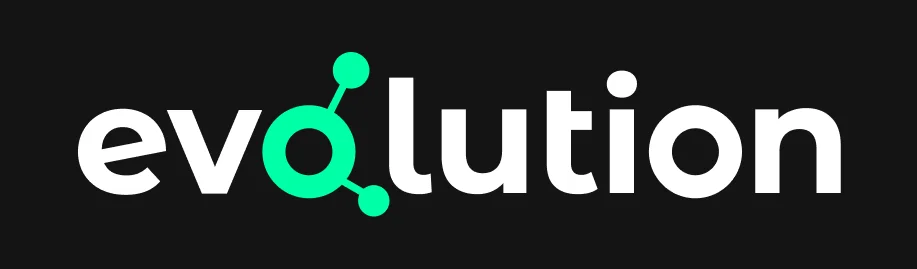
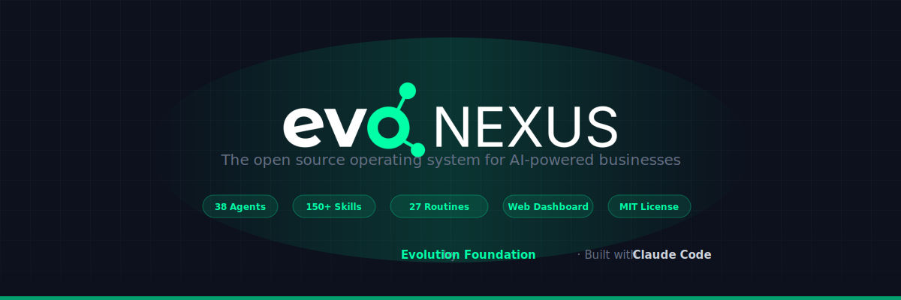
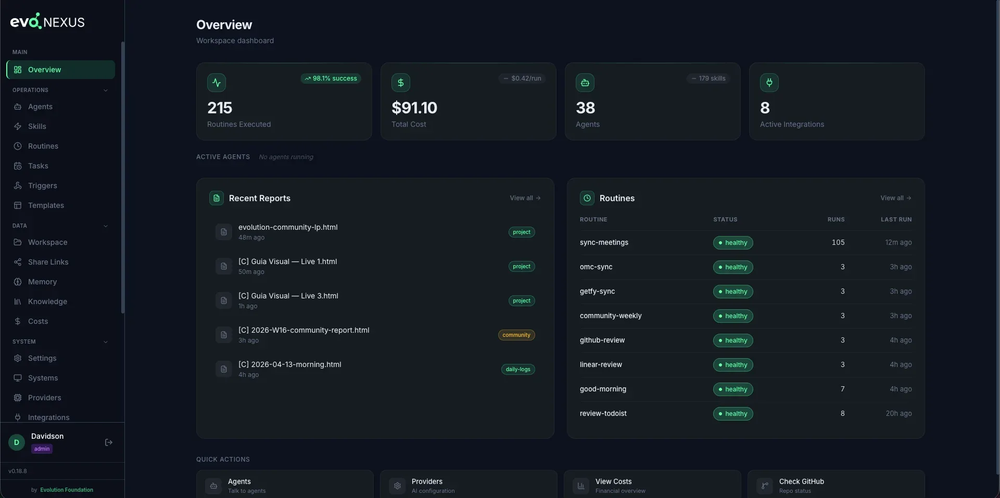
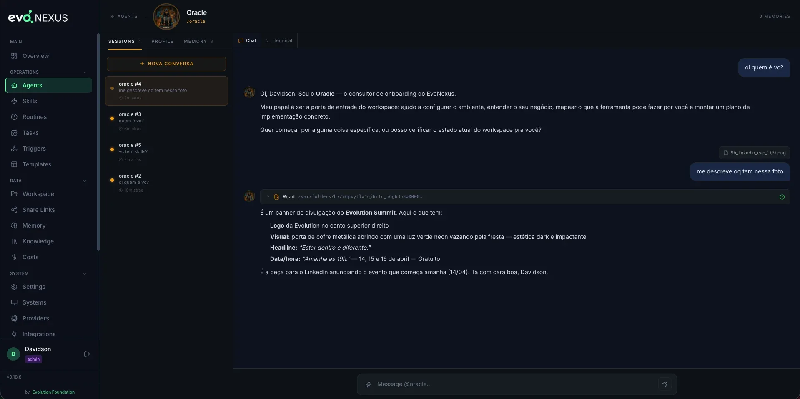
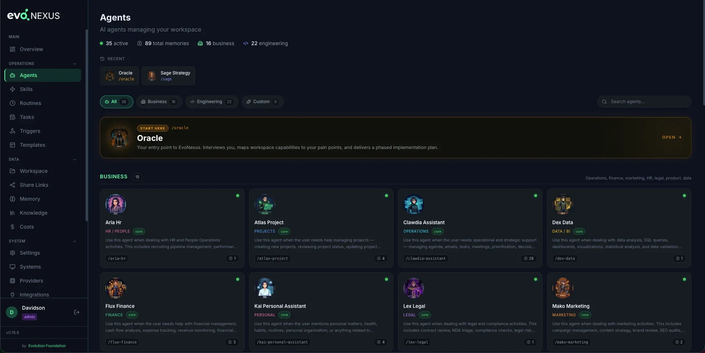
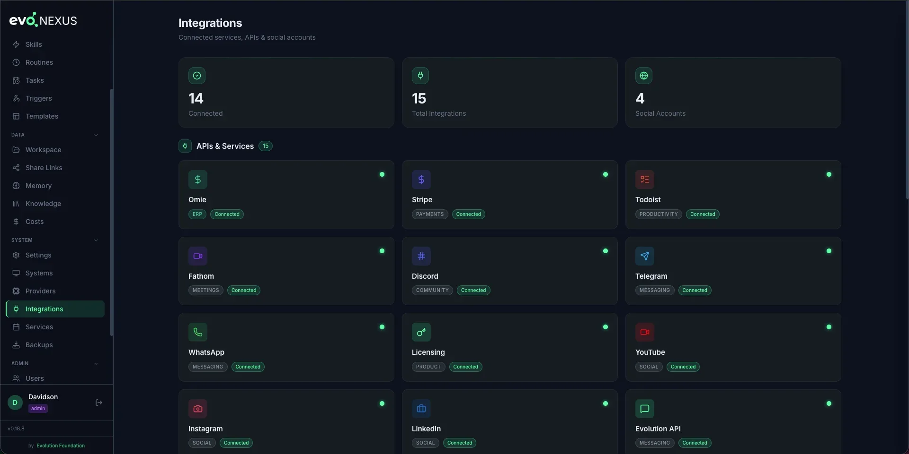
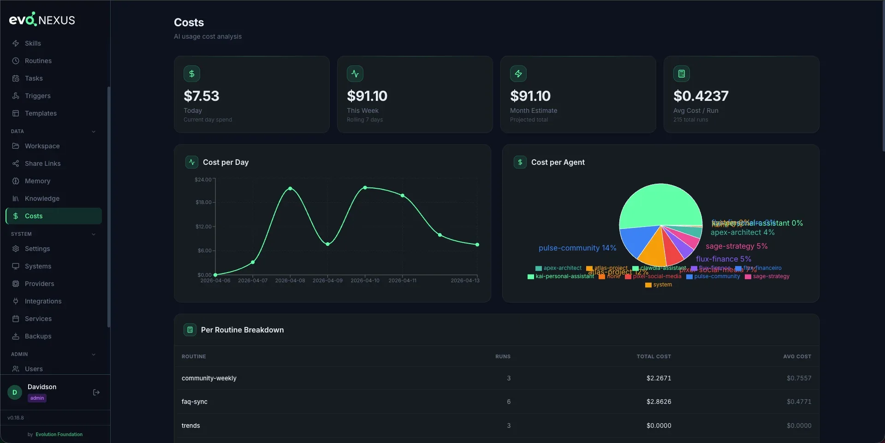

<p align="center">
  <a href="https://evolutionfoundation.com.br">
    
  </a>
</p>

<p align="center">
  
</p>

<h1 align="center">EvoNexus</h1>

<p align="center">
  Multi-agent operating layer built around the Claude Code CLI — part of the Evolution Foundation ecosystem.
</p>

<p align="center">
  <a href="https://github.com/evolution-foundation/evo-nexus/releases/latest"></a>
  <a href="https://opensource.org/licenses/Apache-2.0"></a>
  <a href="https://docs.evolutionfoundation.com.br"></a>
  <a href="https://evolutionfoundation.com.br/community"></a>
</p>

<p align="center">
  <a href="https://evolutionfoundation.com.br">Website</a> &middot;
  <a href="https://docs.evolutionfoundation.com.br">Documentation</a> &middot;
  <a href="#quick-start">Quick Start</a> &middot;
  <a href="#web-dashboard">Dashboard</a> &middot;
  <a href="https://evolutionfoundation.com.br/community">Community</a> &middot;
  <a href="mailto:suporte@evofoundation.com.br">Support</a>
</p>

---

> **Disclaimer:** EvoNexus is an independent, **unofficial open-source project**. It is **not affiliated with, endorsed by, or sponsored by Anthropic**. "Claude" and "Claude Code" are trademarks of Anthropic, PBC. This project integrates with Claude Code as a third-party tool and requires users to provide their own installation and credentials.

---

## What It Is

EvoNexus is an open source, **unofficial** multi-agent operating layer built around the [Claude Code](https://docs.anthropic.com/en/docs/claude-code) CLI protocol — but **not locked to any single LLM provider**. It runs natively on Anthropic's `claude` CLI by default, and can transparently switch to OpenAI, Google Gemini, OpenRouter (200+ models), AWS Bedrock, Google Vertex AI, or Codex Auth via [OpenClaude](https://www.npmjs.com/package/@gitlawb/openclaude). Same agents, same skills, same workflows — your choice of backend.

It turns a single CLI installation into a team of **38 specialized agents** organized in two ortogonal layers — **17 business agents** (operations, finance, community, marketing, HR, legal, product, data, learning retention) and **21 engineering agents** (architecture, planning, code review, testing, debugging, security, design, cycle orchestration, retrospective — 19 derived from [oh-my-claudecode](https://github.com/yeachan-heo/oh-my-claudecode), MIT, by Yeachan Heo + 2 native: Helm and Mirror). The engineering layer follows a canonical 6-phase workflow documented in `.claude/rules/dev-phases.md`.

**This is not a chatbot.** It is a real operating layer that runs routines, generates HTML reports, syncs meetings, triages emails, monitors community health, tracks financial metrics, and consolidates everything into a unified dashboard — all automated.

## Part of the Evolution Foundation ecosystem

EvoNexus is one of the projects maintained by Evolution Foundation. It is the operating layer that orchestrates the Foundation's own work — including the development of [Arco CRM Community](https://github.com/evolution-foundation/evo-crm-community), [Evolution API](https://github.com/evolution-foundation/evolution-api) and [Evolution Go](https://github.com/evolution-foundation/evolution-go).

### Why EvoNexus?

- **Markdown-first agents** — agents are `.md` files with system prompts, not code. No SDK, no compile step. Add an agent by dropping a file in `.claude/agents/`, or package reusable bundles via the plugin system (see [`docs/introduction.md`](docs/introduction.md))
- **Skills as instructions** — reusable capabilities are markdown too. 190+ skills covering finance, community, social, engineering, data, legal, HR, ops, product, CS
- **Multi-provider by design** — default runs on Anthropic's native `claude` CLI, but can switch to OpenRouter, OpenAI, Gemini, AWS Bedrock, Google Vertex, or Codex Auth via [OpenClaude](https://www.npmjs.com/package/@gitlawb/openclaude) without touching a line of code. Your keys, your model choice, no vendor lock-in
- **MCP integrations** — first-class support for Google Calendar, Gmail, GitHub, Linear, Telegram, Canva, Notion, and more via the Model Context Protocol
- **Slash commands** — `/clawdia`, `/flux`, `/pulse`, `/apex` invoke agents directly from the terminal
- **Persistent memory** — `CLAUDE.md` + per-agent memory survives across sessions
- **CLI-first, local-only** — runs anywhere the Claude CLI (or OpenClaude) runs. Your data never leaves your infrastructure

---

## Key Features

- **Multi-Provider** — runs on Anthropic (native `claude`) or any of 6 alternate backends via [OpenClaude](https://www.npmjs.com/package/@gitlawb/openclaude): OpenRouter (200+ models), OpenAI, Google Gemini, Codex Auth, AWS Bedrock, Google Vertex AI. Switch providers from the dashboard, no code changes
- **17 Core Business Agents + Custom** — Ops, Finance, Projects, Community, Social, Strategy, Sales, Courses, Learning Retention, Personal, Knowledge, Marketing, HR, Customer Success, Legal, Product, Data — plus user-created `custom-*` agents (gitignored)
- **21 Engineering Agents** — architecture, planning, code review, testing, debugging, security, design, cycle orchestration, retrospective
- **190+ Skills + Custom** — organized by domain prefix (`social-`, `fin-`, `int-`, `prod-`, `mkt-`, `gog-`, `obs-`, `discord-`, `pulse-`, `sage-`, `hr-`, `legal-`, `ops-`, `cs-`, `data-`, `pm-`, `dev-`)
- **7 Core + 20 Custom Routines** — daily, weekly, and monthly ADWs managed by a scheduler
- **Web Dashboard** — React + Flask app with auth, roles, web terminal, service management
- **19+ Integrations** — Google Calendar, Gmail, Linear, GitHub, Discord, Telegram, Stripe, Omie, Bling, Asaas, Fathom, Todoist, YouTube, Instagram, LinkedIn, Evolution API, Evolution Go, Arco CRM, and more
- **Persistent Memory** — two-tier system (CLAUDE.md + memory/) with LLM Wiki pattern
- **Knowledge Base** — optional semantic search via [MemPalace](https://github.com/milla-jovovich/mempalace) (local ChromaDB vectors, one-click install)
- **Full Observability** — JSONL logs, execution metrics, cost tracking per routine
- **Heartbeats** — proactive agents that wake on a schedule, run a 9-step protocol, and decide whether to act
- **Goal Cascade** — Mission → Project → Goal → Task hierarchy
- **Tickets** — persistent conversation/work threads with atomic checkout

---

## Screenshots

<p align="center">
  
  
</p>
<p align="center">
  
  
</p>
<p align="center">
  
</p>

---

## Quick Start

> **Starting out?** After installing, open Claude Code and call **`/oracle`**. It's the official entry point of EvoNexus: runs the initial setup, interviews you about your business, shows what the toolkit can automate for you, and delivers a phased activation plan.

### Method 1 — Docker (no setup, runs anywhere)

```bash
curl -O https://raw.githubusercontent.com/evolution-foundation/evo-nexus/main/docker-compose.hub.yml
docker compose -f docker-compose.hub.yml up -d
open http://localhost:8080
```

The setup wizard loads on first boot. Paste your Anthropic / OpenAI / Codex key and you're done. Full guide: [docs/guides/docker-install.md](docs/guides/docker-install.md).

### Method 2 — One command (CLI)

```bash
npx @evoapi/evo-nexus
```

### Method 3 — Manual clone (developers / contributors)

```bash
git clone --depth 1 https://github.com/evolution-foundation/evo-nexus.git
cd evo-nexus

# Interactive setup wizard
make setup
```

### Prerequisites

| Tool | Required | Install |
|---|---|---|
| **Claude Code** | Yes (CLI install) | `npm install -g @anthropic-ai/claude-code` |
| **Python 3.11+** | Yes (CLI install) | via `uv` |
| **Node.js 18+** | Yes (CLI install) | [nodejs.org](https://nodejs.org) |
| **uv** | Yes (CLI install) | `curl -LsSf https://astral.sh/uv/install.sh \| sh` |
| **Docker Engine 24+** | Yes (Docker install) | [docs.docker.com/engine/install](https://docs.docker.com/engine/install/) |

---

## AI Providers

EvoNexus runs on **Anthropic's Claude** by default. For OpenAI, Gemini, Bedrock, OpenRouter, Vertex AI, or Codex Auth, it switches to [OpenClaude](https://www.npmjs.com/package/@gitlawb/openclaude).

| Provider | Binary | Key env vars |
|---|---|---|
| **Anthropic** (default) | `claude` | native auth |
| **OpenRouter** (200+ models) | `openclaude` | `CLAUDE_CODE_USE_OPENAI`, `OPENAI_BASE_URL`, `OPENAI_API_KEY`, `OPENAI_MODEL` |
| **OpenAI** | `openclaude` | `CLAUDE_CODE_USE_OPENAI`, `OPENAI_API_KEY`, `OPENAI_MODEL` |
| **Google Gemini** | `openclaude` | `CLAUDE_CODE_USE_GEMINI`, `GEMINI_API_KEY`, `GEMINI_MODEL` |
| **Codex Auth** | `openclaude` | `CLAUDE_CODE_USE_OPENAI`, `OPENAI_MODEL=codexplan` |
| **AWS Bedrock** | `openclaude` | `CLAUDE_CODE_USE_BEDROCK`, `AWS_REGION`, `AWS_BEARER_TOKEN_BEDROCK` |
| **Google Vertex AI** | `openclaude` | `CLAUDE_CODE_USE_VERTEX`, `ANTHROPIC_VERTEX_PROJECT_ID`, `CLOUD_ML_REGION` |

```bash
npm install -g @gitlawb/openclaude
```

The setup wizard asks which provider you want during `make setup`, and you can switch at any time from the **Providers** page in the dashboard.

---

## Web Dashboard

A full web UI at `http://localhost:8080`:

| Page | What it does |
|---|---|
| **Overview** | Unified dashboard with metrics from all agents |
| **Systems** | Register and manage apps/services |
| **Reports** | Browse HTML reports generated by routines |
| **Agents** | View agent definitions and system prompts |
| **Routines** | Metrics per routine + manual run |
| **Tasks** | Schedule one-off actions at a specific date/time |
| **Skills** | Browse all 190+ skills by category |
| **Templates** | Preview HTML report templates |
| **Services** | Start/stop scheduler, channels with live logs |
| **Memory** | Browse agent and global memory files |
| **Knowledge** | Semantic search via [MemPalace](https://github.com/milla-jovovich/mempalace) |
| **Integrations** | Status of all connected services + OAuth setup |
| **Chat** | Embedded Claude Code terminal (xterm.js + WebSocket) |
| **Users** | User management with roles |
| **Audit Log** | Full audit trail of all actions |
| **Config** | View CLAUDE.md, routines config, workspace settings |

```bash
make dashboard-app   # Start Flask + React on :8080
```

---

## Architecture

```
User (human)
    |
    v
Claude Code (orchestrator)
    |
    +-- Clawdia   — ops: agenda, emails, tasks, decisions, dashboard
    +-- Flux      — finance: Stripe, ERP, MRR, cash flow, monthly close
    +-- Atlas     — projects: Linear, GitHub, milestones, sprints
    +-- Pulse     — community: Discord, WhatsApp, sentiment, FAQ
    +-- Pixel     — social: content, calendar, cross-platform analytics
    +-- Sage      — strategy: OKRs, roadmap, prioritization, scenarios
    +-- Nex       — sales: pipeline, proposals, qualification
    +-- Mentor    — courses: learning paths, modules
    +-- Kai       — personal: health, habits, routine
    +-- Oracle    — entry point: onboarding, business discovery
    +-- Mako      — marketing: campaigns, content, SEO, brand
    +-- Aria      — HR: recruiting, onboarding, performance
    +-- Zara      — customer success: triage, escalation, health
    +-- Lex       — legal: contracts, compliance, NDA, risk
    +-- Nova      — product: specs, roadmaps, metrics, research
    +-- Dex       — data/BI: analysis, SQL, dashboards
```

Each agent has:
- System prompt in `.claude/agents/`
- Slash command in `.claude/commands/`
- Persistent memory in `.claude/agent-memory/`
- Related skills in `.claude/skills/`

---

## Documentation

| Resource | Link |
|---|---|
| Website | [evolutionfoundation.com.br](https://evolutionfoundation.com.br) |
| Documentation | [docs.evolutionfoundation.com.br](https://docs.evolutionfoundation.com.br) |
| Community | [evolutionfoundation.com.br/community](https://evolutionfoundation.com.br/community) |
| Getting Started | [docs/getting-started.md](docs/getting-started.md) |
| Architecture | [docs/architecture.md](docs/architecture.md) |
| Routines | [ROUTINES.md](ROUTINES.md) |
| Roadmap | [ROADMAP.md](ROADMAP.md) |
| Changelog | [CHANGELOG.md](CHANGELOG.md) |
| Contributing | [CONTRIBUTING.md](CONTRIBUTING.md) |
| Security | [SECURITY.md](SECURITY.md) |

---

## Contributing

Contributions are welcome! Please read [CONTRIBUTING.md](CONTRIBUTING.md) for guidelines on how to submit issues, propose features, and open pull requests.

Join our [community](https://evolutionfoundation.com.br/community) to discuss ideas and collaborate.

---

## Security

For security issues, **do not open a public issue**. Email **suporte@evofoundation.com.br** or use GitHub's private vulnerability reporting. See [SECURITY.md](SECURITY.md) for details.

---

## Credits & Acknowledgments

EvoNexus stands on the shoulders of great open source projects:

- **[oh-my-claudecode](https://github.com/yeachan-heo/oh-my-claudecode)** by **Yeachan Heo** (MIT) — 19 of the 21 engineering agents (including `apex-architect`, `bolt-executor`, `lens-reviewer`) and all `dev-*` skills are derived from OMC v4.11.4. The 2 native agents (`helm-conductor`, `mirror-retro`) and the 6-phase workflow (`.claude/rules/dev-phases.md`) are EvoNexus-native additions. See [NOTICE.md](NOTICE.md) for the full list of derived components and modifications.

---

## License

EvoNexus is licensed under the Apache License 2.0, with additional brand-protection conditions (LOGO/copyright preservation and Usage Notification requirement). See [LICENSE](LICENSE) for full details.

For licensing inquiries, contact **suporte@evofoundation.com.br**.

## Trademarks

"Evolution Foundation", "Evolution" and "EvoNexus" are trademarks of Evolution Foundation. See [TRADEMARKS.md](TRADEMARKS.md) for the brand assets policy.

Third-party attributions are documented in [NOTICE](NOTICE) and [NOTICE.md](NOTICE.md).

---

<p align="center">
  An unofficial community toolkit for <a href="https://docs.anthropic.com/en/docs/claude-code">Claude Code</a>
  <br/>
  Made by <a href="https://evolutionfoundation.com.br">Evolution Foundation</a> · © 2026
  <br/>
  <sub>Not affiliated with Anthropic</sub>
</p>
