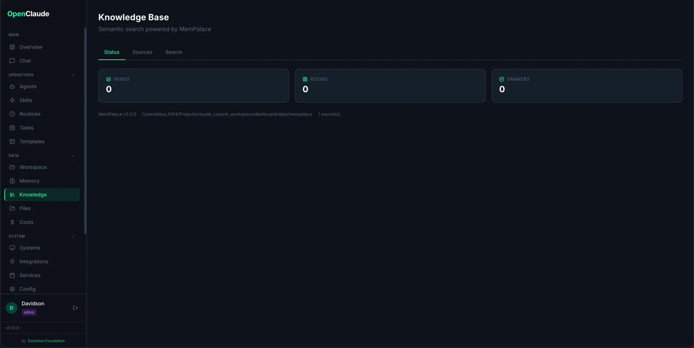

# Knowledge Base (MemPalace)

The Knowledge Base page provides semantic search over your code, documentation, and project knowledge. It is powered by **[MemPalace](https://github.com/milla-jovovich/mempalace)**, an open-source local memory system that indexes content into a searchable vector database.

> **GitHub:** [github.com/milla-jovovich/mempalace](https://github.com/milla-jovovich/mempalace) — MIT License, 27k+ stars

Everything runs locally — no external APIs, no data leaves your machine.



## Enabling MemPalace

MemPalace is an **optional** feature. When you first visit the Knowledge Base page, you'll see an "Enable MemPalace" button.

1. Go to **Dashboard > Knowledge**
2. Click **Install MemPalace**
3. Wait for the installation to complete (installs via pip)

**Requirements:** Python 3.9+

The installation adds the `mempalace` package and its dependency `chromadb` (the vector database engine).

## How It Works

MemPalace organizes knowledge using a "memory palace" metaphor:

| Concept | Description |
|---------|-------------|
| **Wing** | A project or top-level category (e.g., `evo-ai`, `docs`) |
| **Room** | A topic within a wing (e.g., `technical`, `architecture`, `decisions`) |
| **Drawer** | A chunk of content (~800 characters) stored with metadata |

When you index a directory, MemPalace:

1. Scans all files (respecting `.gitignore`)
2. Splits content into chunks of ~800 characters
3. Classifies each chunk into a room based on content and file path
4. Stores vector embeddings in ChromaDB for semantic search

All data is stored locally at `dashboard/data/mempalace/`.

## Adding Sources

Sources are directories you want to index — project code, documentation folders, etc.

1. Go to the **Sources** tab
2. Enter the **directory path** (absolute path on your machine)
3. Optionally set a **label** (display name) and **wing override** (custom project name)
4. Click **Add**

MemPalace only re-processes files that have changed since the last indexing, so re-indexing is fast.

## Indexing (Mining)

After adding sources, click the **Play** button next to a source to index it, or use **Index All** to process everything.

Mining runs in the background — you can navigate away and check progress on the **Status** tab. The status indicator shows when mining is active.

## Searching

The **Search** tab provides semantic search across all indexed content:

1. Type your query in natural language (e.g., "how does authentication work")
2. Optionally filter by **wing** (project) or **room** (category)
3. Press Enter or click **Search**

Results show:
- The matched content snippet
- Source file path
- Similarity score (higher = more relevant)
- Wing and room tags

Semantic search finds results by meaning, not just keyword matching. For example, searching "auth" will also find content about "login", "session tokens", and "JWT".

## Permissions

| Permission | Who has it | What it allows |
|------------|-----------|----------------|
| `mempalace:view` | admin, operator, viewer | View status, sources, and search |
| `mempalace:manage` | admin | Install, add/remove sources, run indexing |

## API Endpoints

All endpoints require authentication and appropriate permissions.

| Method | Endpoint | Description |
|--------|----------|-------------|
| `GET` | `/api/mempalace/status` | Installation status, palace stats, mining status |
| `POST` | `/api/mempalace/install` | Install MemPalace package |
| `GET` | `/api/mempalace/sources` | List configured sources |
| `POST` | `/api/mempalace/sources` | Add a new source directory |
| `DELETE` | `/api/mempalace/sources/:idx` | Remove a source by index |
| `POST` | `/api/mempalace/mine` | Start indexing (background process) |
| `GET` | `/api/mempalace/search?q=...` | Semantic search with optional `wing`, `room`, `n` filters |

## MCP Integration

For advanced users, MemPalace can also be registered as an MCP server for direct Claude Code access:

```bash
claude mcp add mempalace -- python -m mempalace.mcp_server --palace dashboard/data/mempalace
```

This enables Claude to query your knowledge base directly during conversations.
