# Dashboard Overview

The EvoNexus web dashboard is a React + Flask application that gives you a visual interface to manage agents, routines, integrations, memory, and more.

## Starting the Dashboard

```bash
make dashboard-app
```

This starts the Flask backend (with WebSocket support) and serves the React frontend on a single port. Default: `http://localhost:8080`.

### Changing the Port

Set the port in `config/workspace.yaml`:

```yaml
dashboard:
  port: 8080
```

Or via environment variable:

```bash
EVONEXUS_PORT=9090 make dashboard-app
```

## First Run Setup

When no users exist in the database, the dashboard redirects to a setup wizard at `/setup`. The wizard walks you through:

1. **Workspace info** -- name, company, timezone
2. **Admin account** -- create your first user (username + password)
3. **Agents** -- choose which of the 17 agents to enable
4. **Integrations** -- select which services to connect

After setup completes, you are logged in as admin and can access all pages.

## Dashboard Pages

### Overview

Unified metrics dashboard. Shows aggregated data from all agents -- financial snapshot, community health, project status, social reach. This is the landing page after login.


### Systems

Register external apps and services your team uses. Each system has a name, URL, type (Docker container, external URL, or iframe), and icon. Useful for quick-access links to tools like Grafana, Portainer, or internal apps.

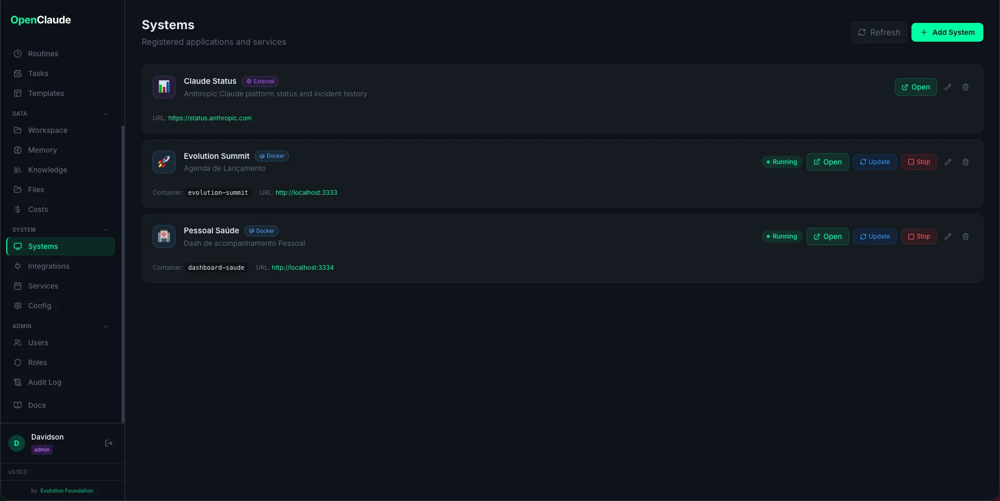

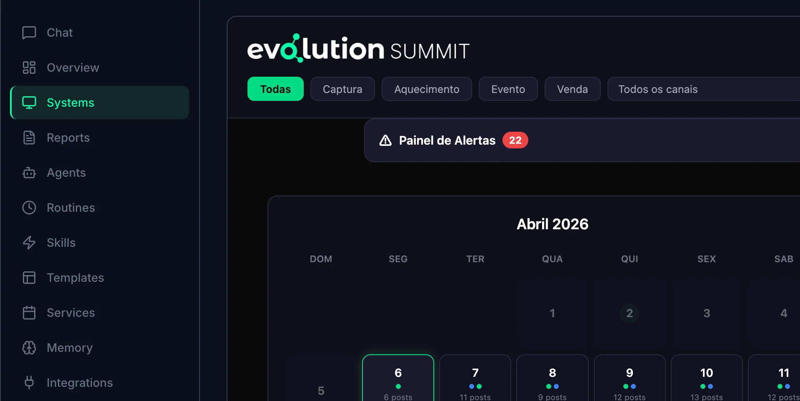

### Reports

Browse HTML reports generated by automated routines. Reports are stored in `workspace/` subfolders and displayed with date, agent, and type. Click any report to view the full HTML in a new tab.

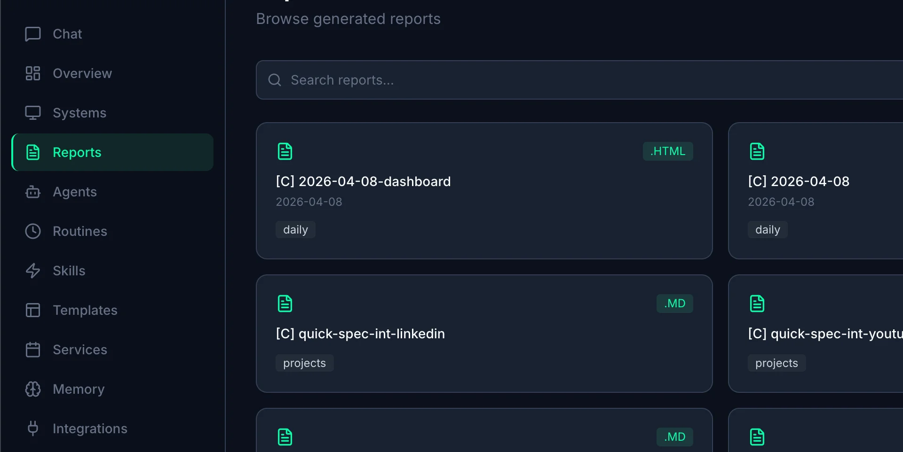

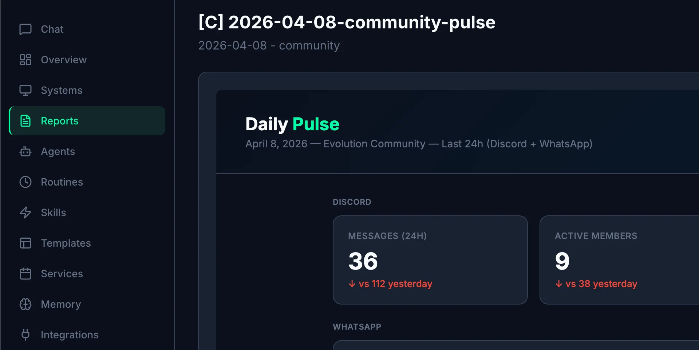

### Agents

View the 16 agent definitions. Each card shows the agent name, slash command, domain, and full system prompt (loaded from `.claude/agents/`). Core agents have dedicated icons and colors; custom agents show a gray badge.

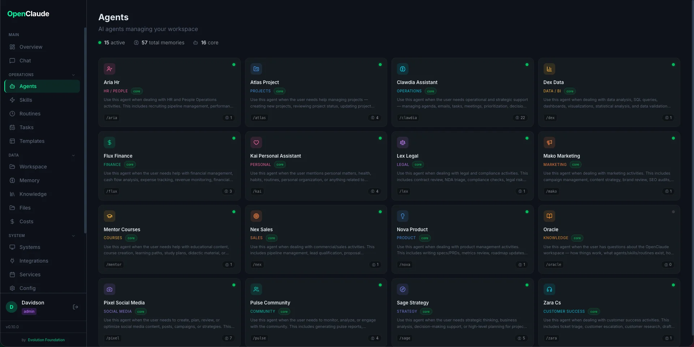

### Routines

Metrics for each automated routine: total runs, success rate, average duration, token usage, and cost. Includes a "Run Now" button to trigger any routine manually.

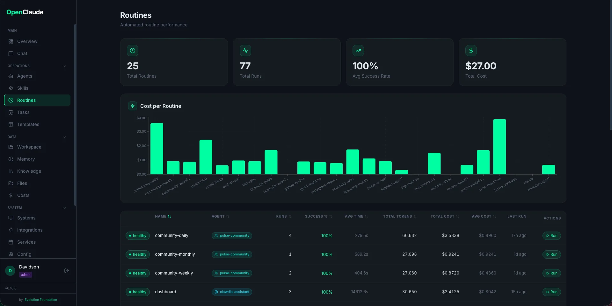

### Tasks

Create and manage one-off scheduled actions. Schedule a skill, prompt, or script to run at a specific date/time. Filter by status (pending, running, completed, failed), create new tasks, run immediately, or view results. See [Scheduled Tasks](../routines/scheduled-tasks.md) for details.

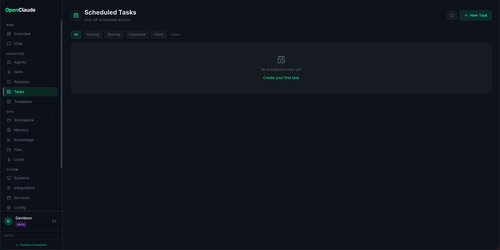

### Triggers

Reactive event triggers -- webhook and event-based. Create triggers that execute skills or routines in response to external events (GitHub push, Stripe payment, Linear updates). Filter by type (webhooks, events), status (enabled, disabled), and manage trigger configurations.

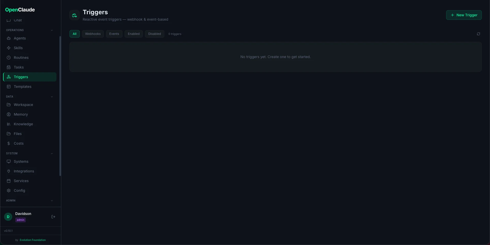

### Skills

Browse all installed skills grouped by prefix (`social-`, `fin-`, `int-`, `prod-`, etc). Click a skill to see its full description, trigger conditions, and source file.

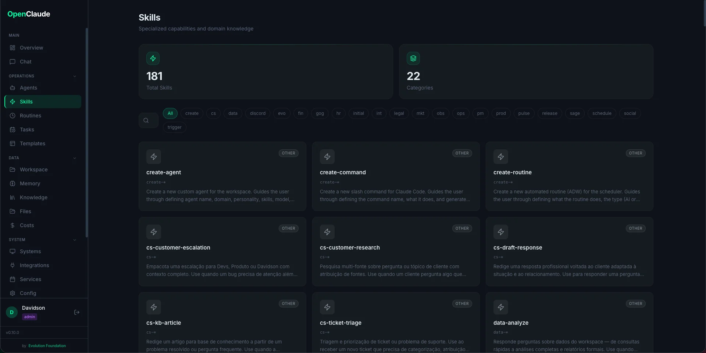

### Templates

Preview the HTML report templates from `.claude/templates/html/`. See how each template renders before routines use them.

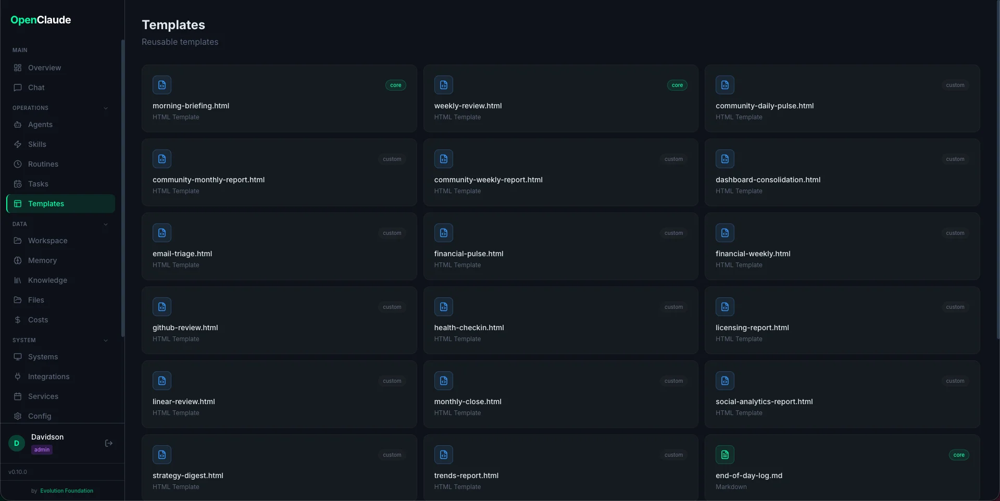

### Services

Start and stop background services (scheduler, Telegram bot) directly from the UI. Shows live log output via WebSocket streaming. Status indicators show whether each service is running.

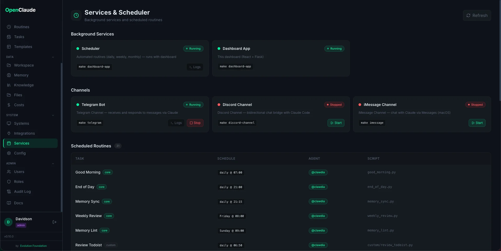

### Workspace

Browse workspace reports and output files organized by domain (community, courses, daily-logs, finance, meetings, personal, projects, social, strategy). Navigate folders, filter files, and open reports directly from the dashboard.

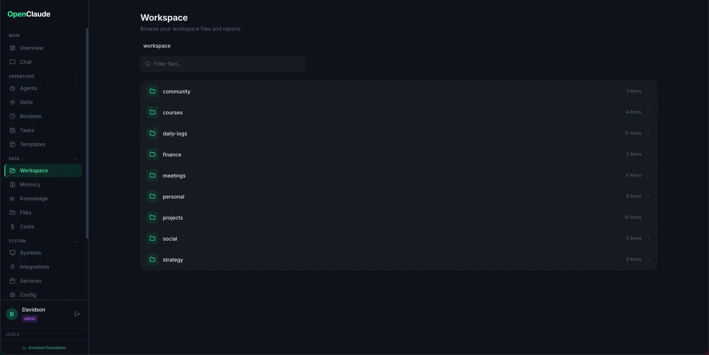

### Memory

Browse the two-tier memory system:
- **CLAUDE.md** -- working memory, loaded every session
- **memory/** -- detailed files (people, projects, glossary, trends)
- **Agent memory** -- per-agent context in `.claude/agent-memory/`

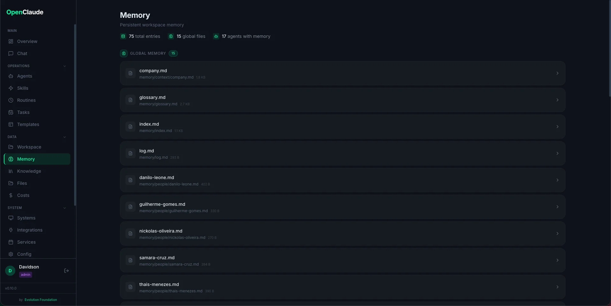

### Knowledge Base

Optional semantic search powered by [MemPalace](https://github.com/milla-jovovich/mempalace). Enable it with one click, add directories (code, docs, notes) as sources, index them, and search by meaning -- not just keywords. Everything runs locally using ChromaDB vectors. See [knowledge-base.md](knowledge-base.md) for details.


### Integrations

Status board for all 18 integrations. Shows which are connected (green), which need configuration (yellow), and which are disabled. Social media accounts (YouTube, Instagram, LinkedIn) can be connected via OAuth directly from this page.

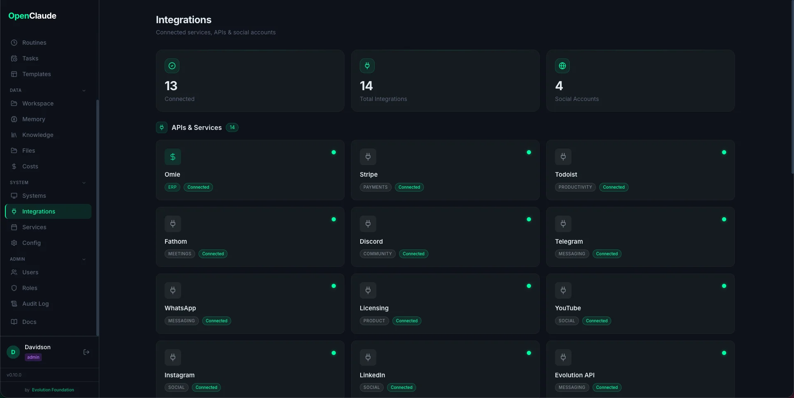

### Providers

Pick and configure which LLM backend powers EvoNexus — Anthropic (default), or any of 6 alternates via [OpenClaude](https://www.npmjs.com/package/@gitlawb/openclaude): OpenRouter, OpenAI, Gemini, Codex Auth, AWS Bedrock, Vertex AI. Each provider card shows install status (claude vs openclaude), configured/unconfigured flags, and a Test button that runs `<binary> --version` with the merged env. Switching provider takes effect immediately — both the terminal-server and the ADW runner re-read `config/providers.json` on every session spawn, no restart needed. Secrets are masked in the UI and in every API response. See [providers.md](providers.md) for the full reference.

### Chat

Embedded Claude Code terminal powered by xterm.js + WebSocket. Run Claude Code commands, invoke agents with slash commands, and see output in real time -- all from the browser.

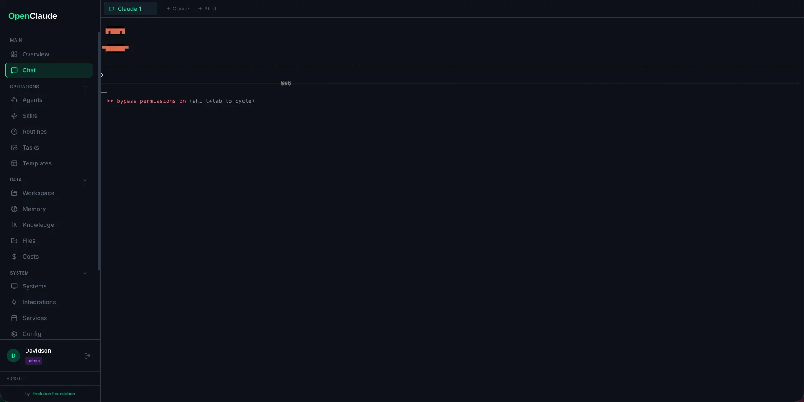

### Users

User management page (admin only). Create, edit, deactivate users. Assign roles. See last login timestamps.

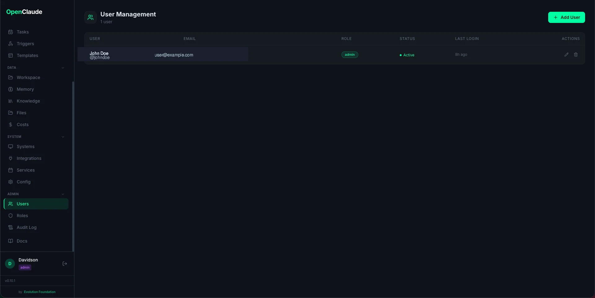

### Roles

Define custom roles with a granular permission matrix. Each role maps resources (chat, services, reports, etc.) to actions (view, execute, manage). Built-in roles (admin, operator, viewer) cannot be deleted but can be cloned.

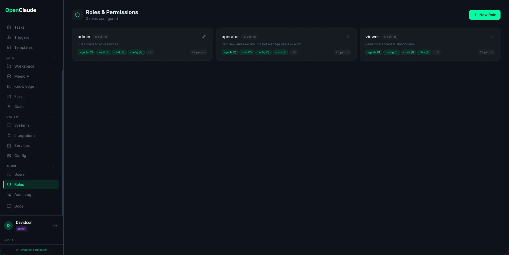

### Costs

Token usage and cost tracking per routine. Displays charts showing cost trends over time, token consumption breakdown (input vs output), and per-routine cost comparison. Useful for monitoring Claude API spend across automated workflows.

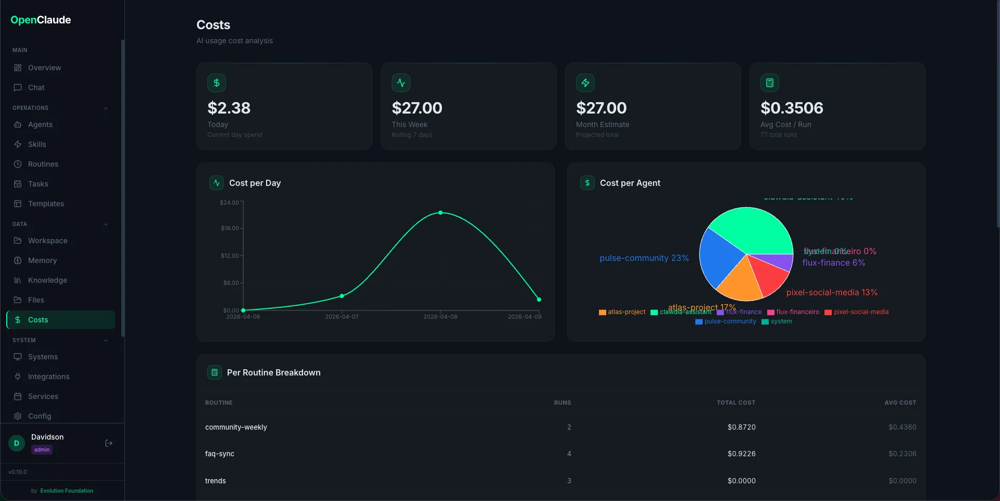

### Files

Browse workspace files directly from the dashboard. Navigate the folder structure, preview file contents, and understand how the workspace is organized without needing terminal access.

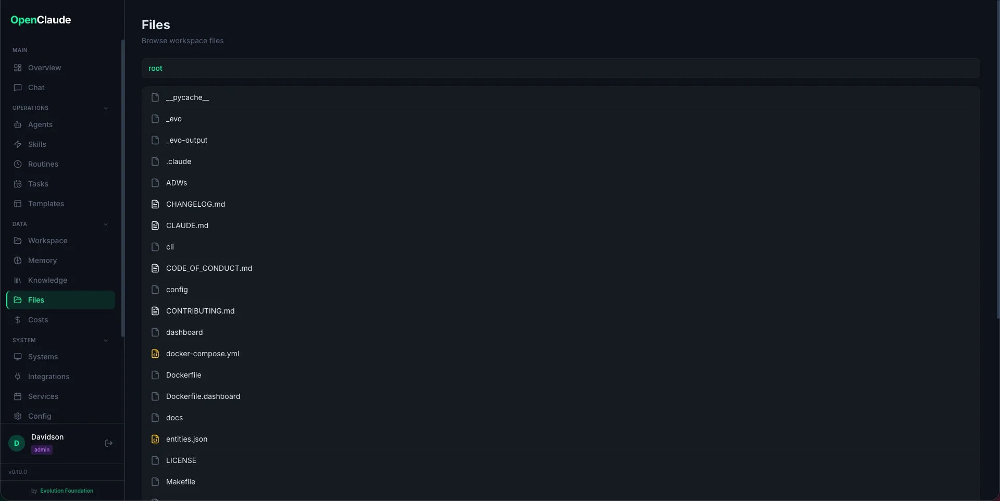

### Scheduler

Manage background services and scheduled routines. Shows all registered routines with core/custom badges, their schedules, enabled/disabled state, and last run status. Start, stop, or trigger routines from this page.

### Audit Log

Full audit trail of all actions: logins, config changes, routine executions, user management. Filterable by user, action, resource, and date range.

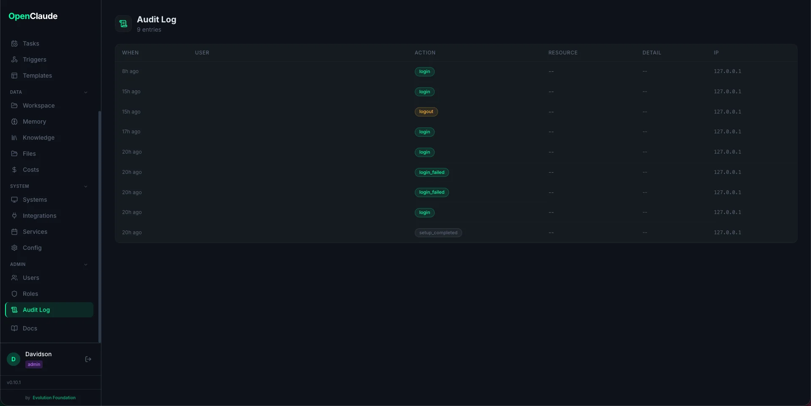

### Backups

Export and restore workspace data (all gitignored user files). Create local backups, download ZIPs, restore with merge or replace mode. Shows S3 configuration status when cloud backup is available. The daily backup routine runs automatically at 21:00.

### Settings

Workspace configuration hub with three tabs:

- **Workspace** -- edit workspace name, owner, company, language, timezone, and dashboard port (`config/workspace.yaml`)
- **Routines** -- toggle routines on/off, edit schedules inline, view agents and scripts (`config/routines.yaml`). Changes trigger automatic scheduler reload.
- **Reference** -- read-only views of CLAUDE.md, Makefile targets, and slash commands
