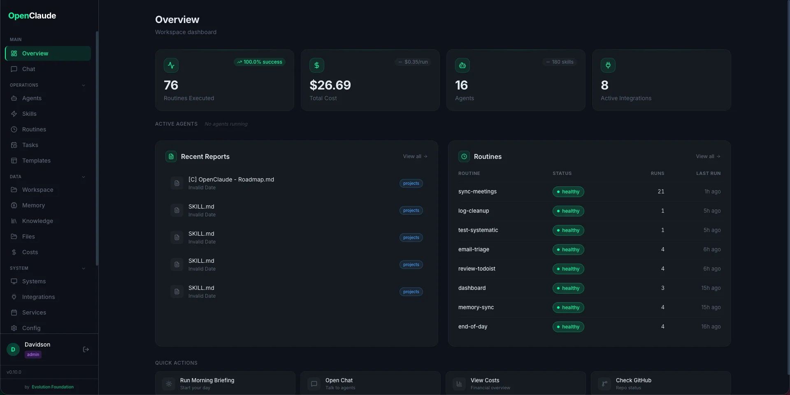

# Getting Started with EvoNexus

## Choose your install method

| Method | Best for | Requires |
|---|---|---|
| **[Docker](guides/docker-install.md)** | Anyone who wants a one-command install that works the same on every OS (Linux, macOS, Windows+WSL2, VPS) | Docker Engine 24+ |
| **CLI (`npx`)** | Users who want to run EvoNexus alongside their existing Claude Code CLI | Claude Code, Python 3.11+, Node 18+, uv |
| **Manual clone** | Developers who want to modify source | git, Claude Code, Python 3.11+, Node 18+, uv |

Pick the Docker flow if you're unsure. Keep reading for the CLI flow.

## Prerequisites (CLI flow only)

- **Claude Code CLI** — [Install Claude Code](https://claude.ai/claude-code)
- **Python 3.11+** with [uv](https://docs.astral.sh/uv/)
- **Node.js 18+** (for the dashboard)
- **API keys** for integrations you want to use

## Installation

### Option A — Docker (fastest)

Pulls the official multi-arch images and runs the wizard at http://localhost:8080. Full guide: [Installing with Docker](guides/docker-install.md).

```bash
curl -O https://raw.githubusercontent.com/EvolutionAPI/evo-nexus/main/docker-compose.hub.yml
docker compose -f docker-compose.hub.yml up -d
open http://localhost:8080
```

Skip to [Start with /oracle](#6-use-claude-code--start-with-oracle) after the wizard completes.

### Option B — `npx` (CLI flow)

```bash
npx @evoapi/evo-nexus
```

This downloads and runs the interactive setup wizard automatically.

### Option C — Manual clone

```bash
git clone --depth 1 https://github.com/EvolutionAPI/evo-nexus.git
cd evo-nexus

# Interactive setup wizard
make setup
# Or: python setup.py
```

The wizard asks for:
- Your name and company
- Timezone and language
- **Which AI provider to use** (Anthropic by default; alternatives via OpenClaude)
- Which agents to enable
- Which integrations to configure

It generates:
- `config/workspace.yaml` — central config
- `config/routines.yaml` — routine schedules
- `config/providers.json` — active AI provider + backend CLI config
- `.env` — API keys (fill in after setup)
- `CLAUDE.md` — context file for Claude

### 2. Choose Your AI Provider

The wizard asks which backend should power EvoNexus. **Anthropic is the default** — if you already have Claude Code authenticated, you don't need to do anything else.

For any other provider (OpenRouter, OpenAI, Gemini, AWS Bedrock, Vertex AI, Codex Auth), EvoNexus uses [OpenClaude](https://www.npmjs.com/package/@gitlawb/openclaude), a drop-in binary compatible with the Claude CLI protocol. Install it once:

```bash
npm install -g @gitlawb/openclaude
```

Then select the provider in the wizard (or later from the **Providers** page in the dashboard) and fill in the keys. The active provider is stored in `config/providers.json` and both the terminal-server and the ADW runner re-read it on every session spawn — no restart required when switching.

See [docs/dashboard/providers.md](dashboard/providers.md) for the full provider reference and [docs/reference/env-variables.md](reference/env-variables.md#ai-provider-configuration) for all provider-related env vars.

### 3. Configure API Keys

Edit `.env` with your keys:

```bash
nano .env
```

At minimum, you need:
- No keys required for basic operation (agents, skills work without integrations)
- `DISCORD_BOT_TOKEN` — for community monitoring
- `STRIPE_SECRET_KEY` — for financial routines
- Social OAuth keys — via the dashboard Integrations page

### 4. Start the Dashboard

**On a VPS (remote):** The setup wizard automatically creates a dedicated `evonexus` system user (Claude Code refuses `--dangerously-skip-permissions` as root) and installs a **systemd service** that starts on boot:

```bash
systemctl status evo-nexus      # check status
systemctl restart evo-nexus     # restart
journalctl -u evo-nexus -f      # follow logs
su - evonexus                   # switch to service user
```

You can also install the systemd service manually on an existing installation:

```bash
sudo bash install-service.sh
```

**Local (macOS/Linux):**

```bash
make dashboard-app
```

Open http://localhost:8080 — the first run shows a setup wizard where you create your admin account and configure the workspace.



### 5. Start Automated Routines

On a VPS, the scheduler runs automatically inside the dashboard service. Locally:

```bash
make scheduler
```

This starts the scheduler that runs routines at their configured times (see `config/routines.yaml`).

### 6. Use Claude Code — start with `/oracle`

Open Claude Code in this directory. It reads `CLAUDE.md` automatically and has access to all agents and skills.

**First thing to run: `/oracle`.** Oracle is the official entry point — it interviews you about your business, maps workspace capabilities to your pain points, and delivers a **phased activation plan** through the `prod-activation-plan` skill (index file + folder-per-phase + file-per-item, each with suggested agent team and pending decisions). You never have to guess the next step.

```bash
/oracle        # Start here — business discovery + activation plan
```

After the plan is ready, you can invoke individual agents:

```bash
/clawdia       # Operations hub
/flux          # Financial analysis
/atlas         # Project management
/pulse         # Community pulse
/pixel         # Social media

# Or let Claude route automatically based on your request
```

## Next Steps

- Read [Architecture](architecture.md) to understand how agents, skills, and routines work together
- Browse `.claude/skills/CLAUDE.md` for the full skill index (175+ skills)
- Check `ROUTINES.md` for routine documentation
- Customize `config/routines.yaml` to adjust schedules
