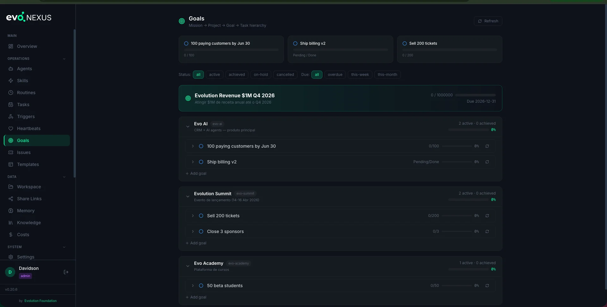

# Goals



**Goals give EvoNexus direction.** Without a goal, routines and heartbeats are just activity. With a goal, every agent run has a target to push toward — and progress is measurable.

## The Hierarchy

```
Mission  →  Project  →  Goal  →  Task
```

Each layer answers a different question:

| Layer | Question | Example |
|---|---|---|
| **Mission** | Why are we doing this? | "Grow Evo AI to 10k paid users" |
| **Project** | What stream of work? | "Sales — Q2 2026" |
| **Goal** | What measurable outcome? | "Reach 80k MRR by June 30" |
| **Task** | What concrete action? | "Launch annual billing plan" |

Missions are optional — a project can stand alone. Goals are required to belong to a project. Tasks optionally belong to a goal (if they do, completing them rolls into `current_value`).

## Why It Matters

Three things happen when you link work to a goal:

1. **Routines inject goal context.** A routine with `goal_id: mrr-80k` in `config/routines.yaml` tells the agent: "this is the outcome you're working toward." Reports, analyses, and recommendations become sharper because the agent knows what "good" looks like.
2. **Heartbeats inject goal context.** Same mechanism — a heartbeat with a `goal_id` gives the proactive agent an anchor.
3. **Progress is visible.** The dashboard shows every goal with `current_value / target_value`, due date, and status. Stale or overdue goals surface automatically.

## Creating a Goal

### Via the `create-goal` skill (recommended)

From Claude Code:

> "Create a goal to reach 80k MRR by June 30."

The skill walks you through:
1. Pick (or create) a mission
2. Pick (or create) a project under it
3. Define the goal — title, metric type, target, due date
4. (Optional) attach starter tasks
5. (Optional) link an existing routine

### Via the dashboard

The **Goals** page has a "New Goal" form. Same fields, same hierarchy.

### Via the API

```bash
# 1. Create the project (if needed)
curl -X POST http://localhost:8080/api/projects \
  -H "Content-Type: application/json" \
  -d '{"slug": "sales-q2-2026", "title": "Sales — Q2 2026", "mission_id": 1}'

# 2. Create the goal
curl -X POST http://localhost:8080/api/goals \
  -H "Content-Type: application/json" \
  -d '{
    "slug": "mrr-80k",
    "project_id": 7,
    "title": "Reach 80k MRR",
    "metric_type": "currency",
    "target_value": 80000,
    "current_value": 62000,
    "due_date": "2026-06-30"
  }'
```

The slug is the public handle. It's what routines and heartbeats reference.

## Metric Types

| `metric_type` | Use for |
|---|---|
| `count` | Number of things (users, signups, posts) |
| `currency` | Revenue, expense, MRR (value in smallest unit — cents or BRL) |
| `percent` | Percentage targets (NPS, conversion rate) |
| `boolean` | One-shot outcomes ("launched", "certified") — `target_value: 1` |
| `tasks` | Count of completed tasks under the goal |

The dashboard renders each type with the right formatting (currency with symbol, percent with `%`, etc.).

## Progress Tracking

### Automatic (via tasks)

Tasks roll up into `current_value`:

1. Create tasks with `goal_id: {numeric_id}`
2. When a task's `status` flips to `done`, the backend recomputes `current_value` from the SQL view `goal_progress_v`
3. When `current_value >= target_value`, the goal's `status` flips to `achieved`

### Manual (direct PATCH)

Non-task metrics (MRR, NPS, follower count) need direct updates:

```bash
curl -X PATCH http://localhost:8080/api/goals/{id} \
  -H "Content-Type: application/json" \
  -d '{"current_value": 67500}'
```

You can wire a routine to do this on a schedule — e.g. a daily `fin-pulse` routine that PATCHes the MRR goal with the latest Stripe figure.

### Drift correction

If task counts get out of sync with `current_value`:

```bash
curl -X POST http://localhost:8080/api/goals/{id}/recalculate
```

Forces a recomputation from the SQL view.

## Linking a Routine

```bash
curl -X POST http://localhost:8080/api/goals/link-routine \
  -H "Content-Type: application/json" \
  -d '{"routine_name": "financial-pulse", "goal_id": "mrr-80k"}'
```

This writes `goal_id: mrr-80k` into the matching routine entry in `config/routines.yaml`. Every future run of that routine will see the goal context.

## Linking a Heartbeat

Heartbeats accept `goal_id` in their YAML entry:

```yaml
- id: flux-6h
  agent: flux-finance
  goal_id: mrr-80k
  # ... rest
```

Same effect as routines — the agent runs with goal context.

## Linking a Ticket

Tickets take a numeric `goal_id` on creation or via PATCH:

```bash
curl -X POST http://localhost:8080/api/tickets \
  -d '{"title": "...", "goal_id": 12}'
```

The ticket appears in the goal's ticket list and counts toward its activity.

## Viewing Progress

### Dashboard

The **Goals** page groups goals by project, shows progress bars, flags overdue items in red, and lets you filter by status (`active`, `achieved`, `dropped`), due window (`overdue`, `this-week`, `this-month`), or project.

### API

```bash
# All active goals
curl "http://localhost:8080/api/goals?status=active"

# Overdue goals
curl "http://localhost:8080/api/goals?due_date=overdue"

# Goals under a project, with tasks
curl "http://localhost:8080/api/goals?project_id=7&include_tasks=true"
```

## Anti-patterns

- **Goals without metrics.** "Make the product better" isn't a goal — it's a wish. Every goal needs `metric_type`, `target_value`, and `due_date`.
- **Goals that never change state.** If `current_value` doesn't move for weeks, the goal is either stale (archive it) or not wired to a signal (add a routine that updates it).
- **Overloading missions.** A mission should span a quarter or longer. If you're creating a mission per week, flatten them into projects.
- **Linking a routine to a non-existent goal slug.** The API returns 404. Confirm the slug with `GET /api/goals` first.

## CLI Skills

| Skill | What it does |
|---|---|
| `create-goal` | Interactive wizard (mission → project → goal → tasks) |

## Related

- `docs/heartbeats.md` — wake agents on intervals with goal context
- `docs/tickets.md` — persistent work units linkable to goals
- Source: `dashboard/backend/routes/goals.py`, `dashboard/backend/goal_context.py`
