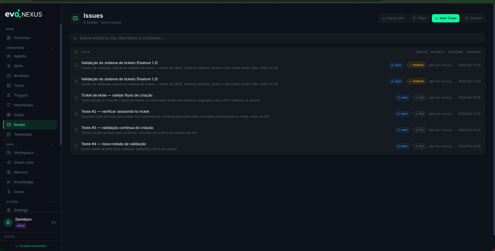
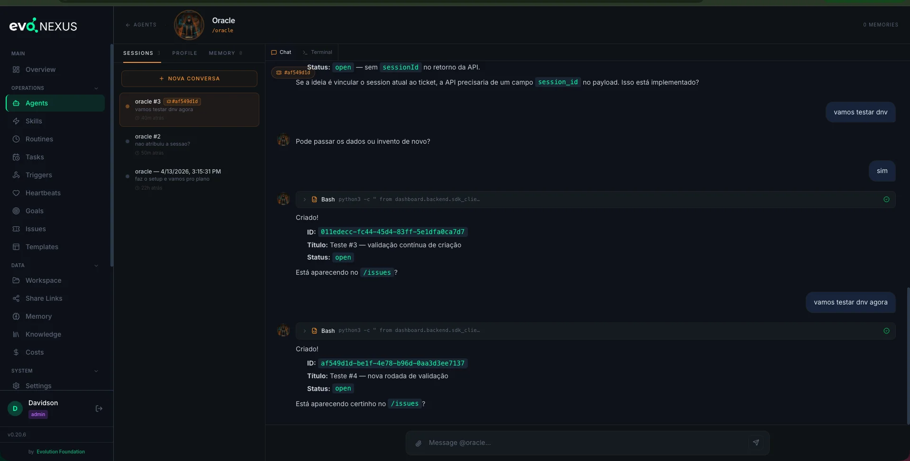
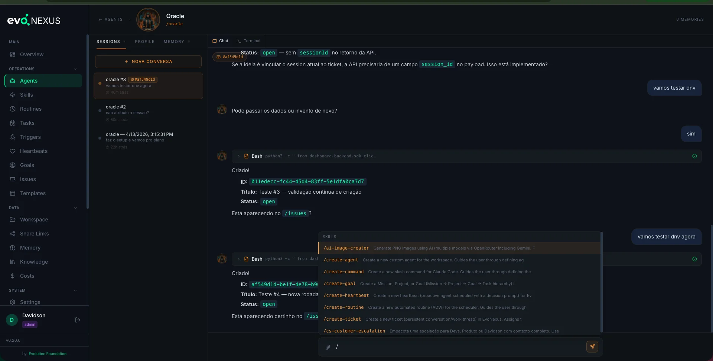
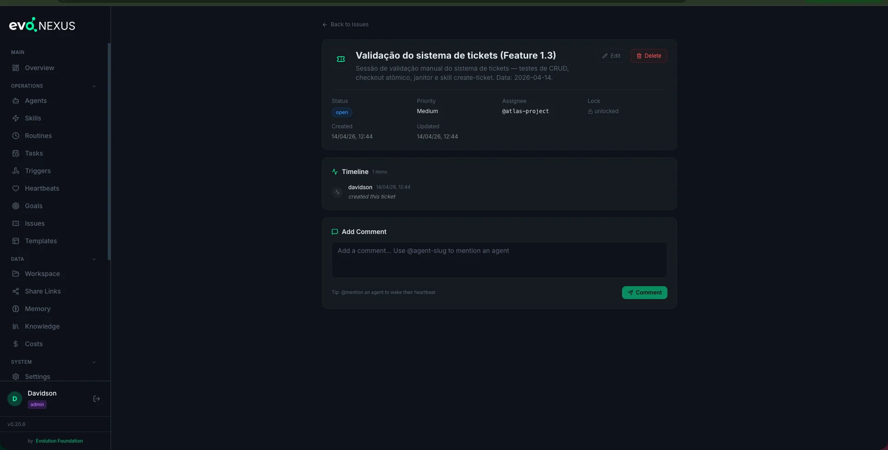

# Tickets



**Tickets are durable conversation threads.** Unlike a chat session — which lives for as long as a terminal is open — a ticket survives restarts, accumulates context, can be picked up by any agent, and tracks progress through a defined workflow.

Use a session for throwaway Q&A. Use a ticket for anything you want to resume, hand off, or track to completion.

## Anatomy of a Ticket

| Field | What it is |
|---|---|
| `id` | UUID, generated on creation |
| `title` | One-line summary |
| `description` | Full context, markdown |
| `status` | `open` / `in_progress` / `waiting` / `resolved` / `closed` |
| `priority` | `urgent` / `high` / `medium` / `low` |
| `assignee_agent` | Agent slug (optional — blank means "any agent") |
| `project_id` | Optional link to a project |
| `goal_id` | Optional link to a goal |
| `locked_at`, `locked_by` | Atomic checkout state |
| `created_at`, `updated_at`, `resolved_at` | Timestamps |
| `comments` | Append-only conversation |
| `activity` | System-generated events (status changes, assignments, checkouts) |

Comments and activity together form the ticket **timeline** — the full history of everything that happened on this ticket.

## Workflow States

```
open  →  in_progress  →  waiting  →  resolved  →  closed
                 ↑____________________|
```

- **open** — nobody has picked it up
- **in_progress** — an agent has checked it out and is working
- **waiting** — blocked on external input (customer reply, human decision)
- **resolved** — work is done, pending final confirmation
- **closed** — terminal; this is what a soft-delete becomes

The backend auto-stamps `resolved_at` when status flips to `resolved` or `closed`.

## Creating a Ticket

### Via the `create-ticket` skill

From Claude Code:

> "Open a ticket for Hawk about the Stripe webhook returning 500."

The skill asks for title, description, priority, optional assignee / project / goal, and calls `POST /api/tickets`.

### Via the dashboard

The **Tickets** page has a "New Ticket" form.

### Via the API

```bash
curl -X POST http://localhost:8080/api/tickets \
  -H "Content-Type: application/json" \
  -d '{
    "title": "Stripe webhook returning 500",
    "description": "Logs attached. Started after deploy #423.",
    "priority": "urgent",
    "assignee_agent": "hawk-debugger",
    "goal_id": 12
  }'
```

## Atomic Checkout

The central safety feature. When an agent wants to work a ticket, it calls:

```bash
POST /api/tickets/{id}/checkout
{"agent": "hawk-debugger", "lock_timeout_seconds": 1800}
```

The backend does:

```sql
UPDATE tickets SET locked_at = NOW(), locked_by = :agent
WHERE id = :id AND locked_at IS NULL
```

Exactly one agent wins the lock. Everyone else gets HTTP 409 `already_locked` with the current holder's name. This is what makes tickets safe when multiple heartbeats point at the same queue — only one agent can actually work the ticket at a time.

### Release

```bash
POST /api/tickets/{id}/release
{"agent": "hawk-debugger"}
```

Only the lock holder can release. The backend verifies `locked_by == agent` before clearing the lock.

### Stale lock sweep

`ticket_janitor.py` runs periodically and releases any lock older than its `lock_timeout_seconds`. This prevents a crashed agent from holding a ticket forever.

## Comments and Mentions

Comments are the live conversation. The description is static; comments accumulate.

```bash
curl -X POST http://localhost:8080/api/tickets/{id}/comments \
  -d '{"body": "kicking this off — @hawk-debugger can you take it?"}'
```

### @Mentions fire heartbeat triggers

If the comment contains `@agent-slug`, and that agent has an **enabled heartbeat** with `mention` in its `wake_triggers`, the backend inserts a row into `heartbeat_triggers`. The dispatcher picks it up on the next tick and wakes the agent — with the ticket + comment as context.

This is how you hand off work to a proactive agent without paging a human first.

### Storm guard

Max 3 mentions per comment. Extras are silently dropped. This prevents a commenter (human or agent) from accidentally firing 50 heartbeats in one message.

## Tickets vs Sessions

|  | Session | Ticket |
|---|---|---|
| **Lifetime** | One chat | Days / weeks |
| **Pickup** | Current user only | Any agent with permission |
| **State** | In-memory | SQLite + audit trail |
| **Locking** | N/A | Atomic `checkout` |
| **Triggers agents** | No | Yes (via @mention) |
| **Visibility** | Terminal scrollback | Dashboard, API, CSV export |

If you want to ask a quick question and move on — session. If the outcome matters, multiple agents might touch it, or you want a record — ticket.

### Session auto-binding

When an agent creates a ticket from inside a chat session, the terminal-server detects the API response and automatically binds the session to the ticket. The session sidebar shows a `🎫 #xxxxxxxx` chip so you can see at a glance which ticket each conversation is about.



Sessions can also be manually attached to an existing ticket via the "No ticket" dropdown above the message input.

### Slash-command autocomplete

Typing `/` in the chat opens a popup with all available skills — filter by substring, navigate with ↑↓, insert with Enter/Tab, close with Esc.



## Operating on Tickets



### List / filter

```bash
# Open urgent tickets assigned to zara-cs
curl "http://localhost:8080/api/tickets?status=open&priority=urgent&assignee_agent=zara-cs"

# All tickets linked to a goal
curl "http://localhost:8080/api/tickets?goal_id=12"

# Full-text search across title, description, comments
curl "http://localhost:8080/api/tickets?q=webhook"
```

### Update

```bash
curl -X PATCH http://localhost:8080/api/tickets/{id} \
  -d '{"status": "in_progress", "assignee_agent": "hawk-debugger"}'
```

Allowed fields: `status`, `priority`, `assignee_agent`, `title`, `description`, `project_id`, `goal_id`. Every change is recorded in the activity log.

### Timeline

```bash
curl http://localhost:8080/api/tickets/{id}/timeline
```

Returns comments + activity, merged and sorted chronologically.

### Bulk actions

```bash
curl -X POST http://localhost:8080/api/tickets/bulk \
  -d '{"ids": ["id1", "id2"], "action": "close"}'
```

Supported: `close`, `reassign`, `relink_goal`.

### Close vs delete

- `DELETE /api/tickets/{id}` (default, soft) — flips status to `closed`, keeps the ticket and its history
- `DELETE /api/tickets/{id}?hard=true` (admin only) — removes the ticket row entirely

Prefer soft. History matters when you revisit a similar issue six months later.

### Export

```bash
curl http://localhost:8080/api/tickets/export.csv > tickets.csv
```

Same filters as list. Up to 10,000 rows per export.

## Anti-patterns

- **Skipping checkout in an automated agent.** Two heartbeats fire at the same second, both grab the same ticket, both run — state corrupts. Always checkout.
- **Writing description-only tickets for in-flight work.** The description is static. Live updates belong in comments, so the timeline tells the story.
- **Mentioning agents that have no enabled heartbeat.** The mention won't fire anything. If you need that agent to pick it up, enable its heartbeat first.
- **Using `?hard=true` casually.** You lose the history. If you need the ticket gone but reviewable, soft-close and archive.
- **Priority inflation.** If everything is `urgent`, nothing is. Reserve `urgent` for outages and P1 customer issues.

## CLI Skills

| Skill | What it does |
|---|---|
| `create-ticket` | Interactive wizard for opening a ticket |

## Related

- `docs/heartbeats.md` — @mentions in ticket comments wake heartbeats
- `docs/goals.md` — link tickets to goals for progress tracking
- Source: `dashboard/backend/routes/tickets.py`, `dashboard/backend/ticket_janitor.py`, `dashboard/backend/ticket_inbox.py`
